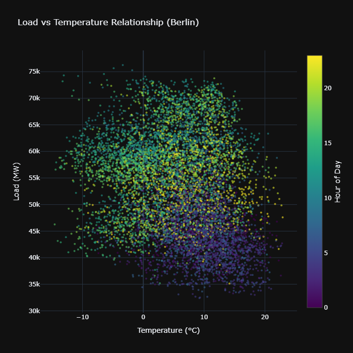

# German Energy Load Forecasting 🔋



A machine learning project to forecast Germany's energy consumption using ENTSO-E data, focusing on sustainable energy management through accurate load prediction.

## 🎯 Project Overview

- Real-time energy load monitoring
- 15-minute interval predictions
- Interactive dashboard for load visualization
- Temperature-based load analysis
- Holiday & seasonal pattern detection

## 🔍 Key Features

- **Data Pipeline**: Automated ENTSO-E API integration
- **Analysis**: Comprehensive EDA with focus on:
  - Daily/Weekly patterns
  - Temperature impact
  - Holiday effects
- **Dashboard**: Live monitoring system
- **Models**: Time series forecasting

## 🛠️ Tech Stack

- **Data**: ENTSO-E API, Python
- **Analysis**: Pandas, NumPy
- **Visualization**: Plotly
- **Dashboard**: Flask
- **Documentation**: MkDocs

## 📊 Sample Insights

- Peak load occurs at 10 AM (~60 GW)
- Weekend loads drop by ~9.3 GW
- Temperature correlation varies by hour
- Holiday impact: ~9.6 GW reduction

## 🚀 Getting Started

### Clone repository

```bash
git clone https://github.com/rishaban360/german-energy-forecast.git
```

### Install dependencies

```bash
pip install -r requirements.txt
```

### Run dashboard

```bash
python src/dashboard/app.py
```
